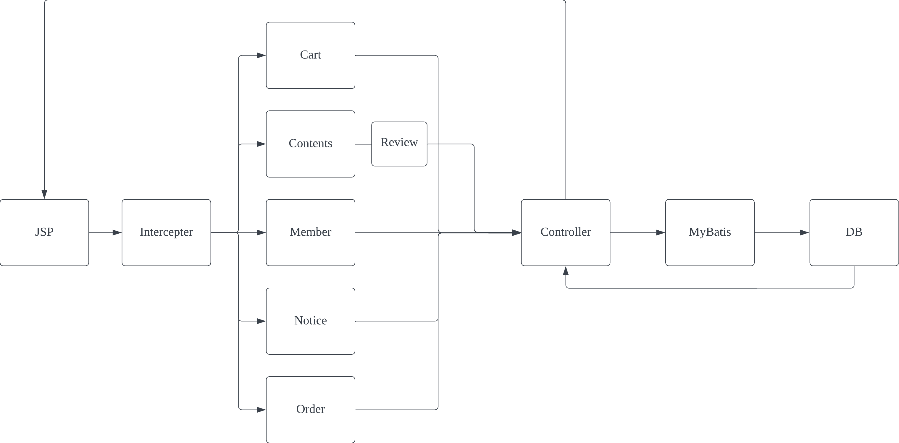

# Spring Boot 기반 쇼핑몰 프로젝트

## Intro

- Spring boot를 활용한 쇼핑몰 프로젝트 입니다
- 기능
  - 회원가입/수정/탈퇴/목록
  - 로그인/로그아웃
  - 상품등록/상품목록/상품수정
  - 장바구니 등록/삭제

## Tech Stack

- **Spring boot**
- **Gradle**
- **MyBatis**
- **Fetch API**
- **jQuery**
- **mySQL**

## Service process

- Shopping mall의 API 호출 과정입니다

## ERD

- Shopping 프로젝트의 ERD 입니다

## API

### Cart

- **prefix :** `/cart`
- 장바구니 물품 삭제 `GET /delete/{cartno}`
- 장바구니 목록 `GET /list`
- 장바구니 담기 `POST /create`

### Contents

- **prefix :** `/contents`
- 제품 이미지 삭제 `GET /delete/{contentsno}/{oldfile}`
- 상품상세 페이지 `GET /detail/{contentsno}`
- 상품목록 `GET /mainlist/{cateno}`
- 상품 카테고리 가져오기 `GET /getCategory`
- 상품 이미지 수정 `POST /updateFile`
- 상품 이미지 수정양식 `GET /updateFile/{contentsno}/{oldfile}`
- 상품 수정 `POST /update`
- 상품 수정 양식 `GET /update/{contentsno}`
- 상품등록(관리자) `POST /create`
- 상품상세 페이지(관리자) `GET /admin/contents/read/{contentsno}`
- 상품목록(관리자) `GET /list`
- 상품 등록 양식(관리자) `GET /admin/contents/create`

### Member

- **prefix :** `/member`
- ID 찾기 `GET /idfind`
- ID 찾기 결과 return `GET /idfindex`
- PW 찾기 `GET /pwfind`
- PW 찾기 결과 return `GET /pwfindex`
- 회원 상세정보(관리자) `GET /read`
- 회원 상세정보(유저) `GET /mypage`
- 회원목록(관리자) `GET/admin/member/list`
- 회원정보 수정 `POST /update`
- 회원정보 수정양식 `GET /update`
- 회원이미지 변경 `POST /updateFile`
- 회원 이미지 변경 양식 `GET /updateFile/{id}/{oldfile}`
- log out `GET /logout`
- log in `POST /login`
- log in 페이지 `GET login`
- 회원가입 `POST /create`
- 이메일 중복확인 `GET /member/emailcheck`
- ID 중복확인 `GET /member/idcheck`
- 이용약관 `GET /agree`
- 회원가입 양식 `POST /createForm`
- 메인 페이지(prefix 없이) `GET /`

### Notice

- **prefix :** `/notice`
- 공지삭제양식(관리자) `GET /admin/notice/delete`
- 공지삭제`POST /delete`
- 공지수정 양식(관리자) `GET /admin/notice/update`
- 공지수정 `POST /update`
- 공지 읽기 `GET /read`
- 공지생성 양식 `GET /admin/notice/create`
- 공지생성 `POST /create`
- 공지목록 `GET /list`

### Order

- **prefix :** `/order`
- 주문상태 수정 `POST /update`
- 주문 목록 `GET /admin/order/list`
- 주문하기 `POST /create/{str}`
- 주문 장바구니에 담기 `GET /create/cart/{cno}/{qty}/{size}`
- 주문 및 결제페이지 이동 `GET create/order/{contentsno}/{qty}/{size}`

### Review

- **prefix :** `/review`

- 댓글 목록 조회 `GET /list/{contentsno}/{sno}/{eno}`
- 댓글 페이지네이션 `GET /page`
- 댓글 등록 `POST /create`
- 댓글수정 모달창 불러오기 `GET /{rnum}`
- 댓글 수정 `PUT /`
- 댓글 삭제 `DELETE /{rnum}`

> ## 추가적으로 구현할 기능

------

- 상품구매 삭제, 추가기능
- 나의정보 페이지에서 이미지 수정기능 및 회원 수정페이지로 바로 이동할 수있는 버튼

> ## Spring DI/AOP 사용

------

- Controller/Service/DAO
- Transaction 기능

> ## Mysql Mybatis

------

> ## PatchNote

- 2023-08-18
  - 유저용 상품 디테일페이지 댓글창 페이지이동이 안되는 오류 해결

---

- 2022-11-22
  - 관리자 상품목록에서 관리자 전용 상품페이지 이동추가
  - 관리자 전용 상품페이지에서 관리자 전용버튼 노출되지 않는 버그 수정
  - 메인페이지 이미지 변경
  - 회원정보 페이지 관리자 전용 버튼 노출되지 않는 오류 수정

-----

- 2022-11-23
  - mypage에서 사용자(user)가 이미지 파일 변경할 수 있도록 적용
    - 자주 혼동하는 것
      - jsp에서 직접 데이터를 호출방법
      - model.setAttribute("이름",호출내용) 을 설정을 해주면 직접 호출가능
      - HttpServletRequest 를 통해 jsp에서 직접데이터를 가져올수 있음(getAttribute, getParameter)
      - setAttribute도 가능
      - HttpSession 을 통해서도 가능함
  - 관리자 상품 수정 페이지에서 이미지를 수정 할 수 있도록 이미지 변경페이지 추가
- 2022-11-24
  - 관리자용 페이지인 contents list에 상품 삭제 기능추가
    - 삭제는 정상적으로 되고 있으나 `redirect:./list` 또는 `/contents/list` 가 실행되지않음
    - 계속 오류 찾고 잇는중
- 2022-11-25
  - 관리자용 contents list 오류해결
    - `redirect:contents/list` 를 사용 했을때 정상작동함
    - 분명 24일 실행할때는 동작하지 않았었는데 현재는 가능해짐
  - 주문목록페이지에서 관리자용 read 페이지로 이동할 수 있게 설정
